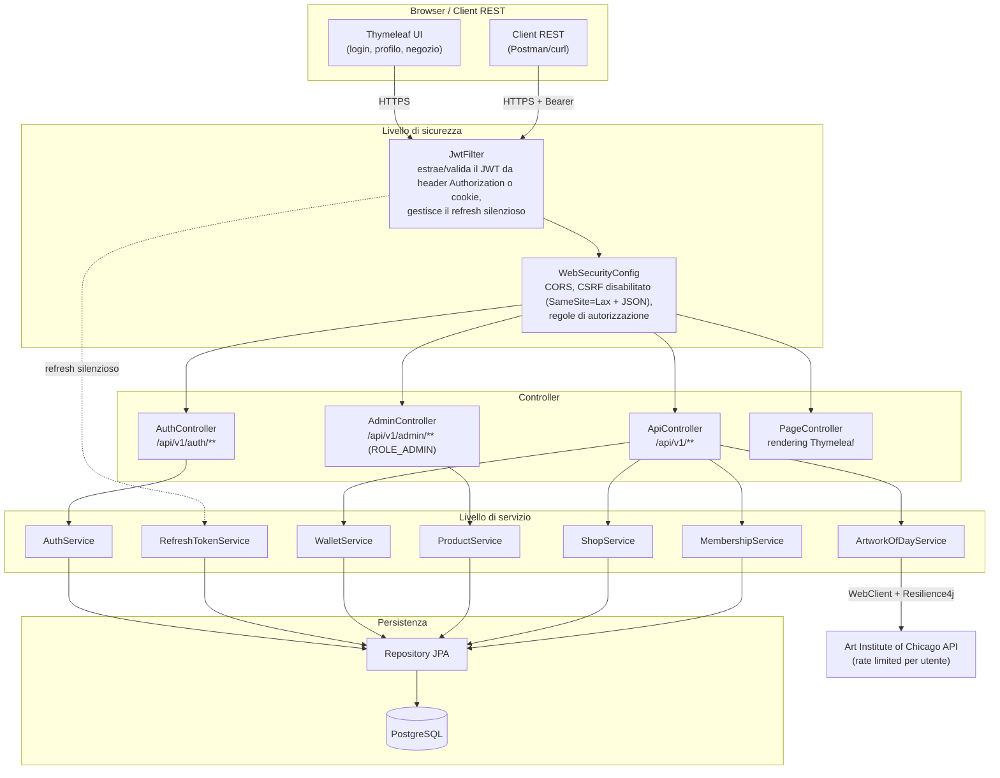
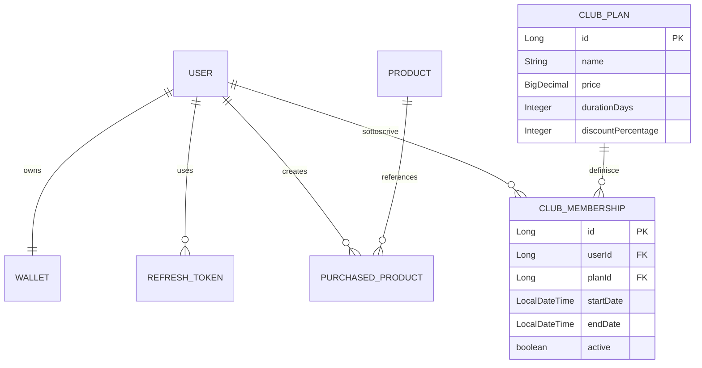
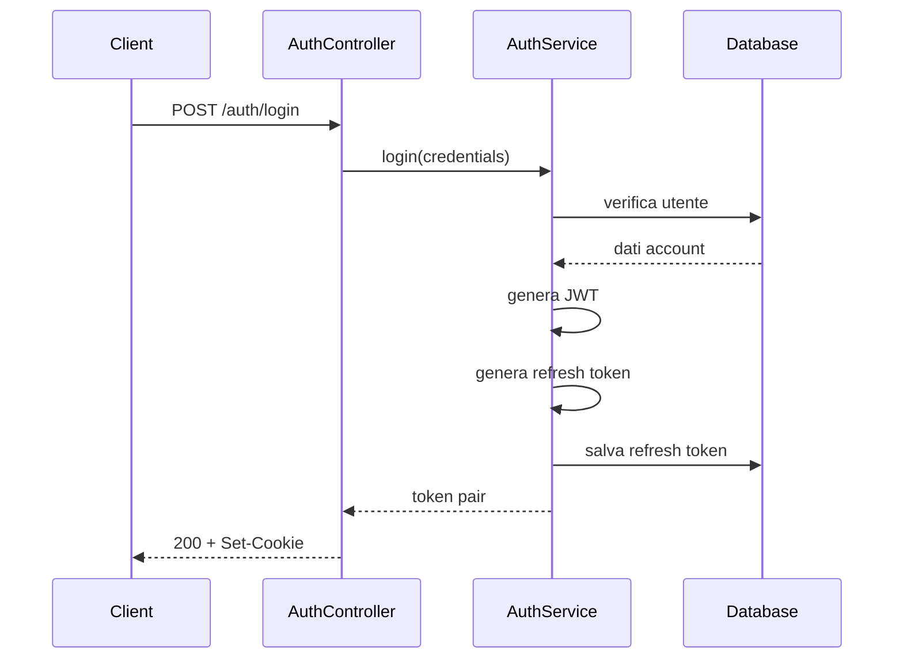
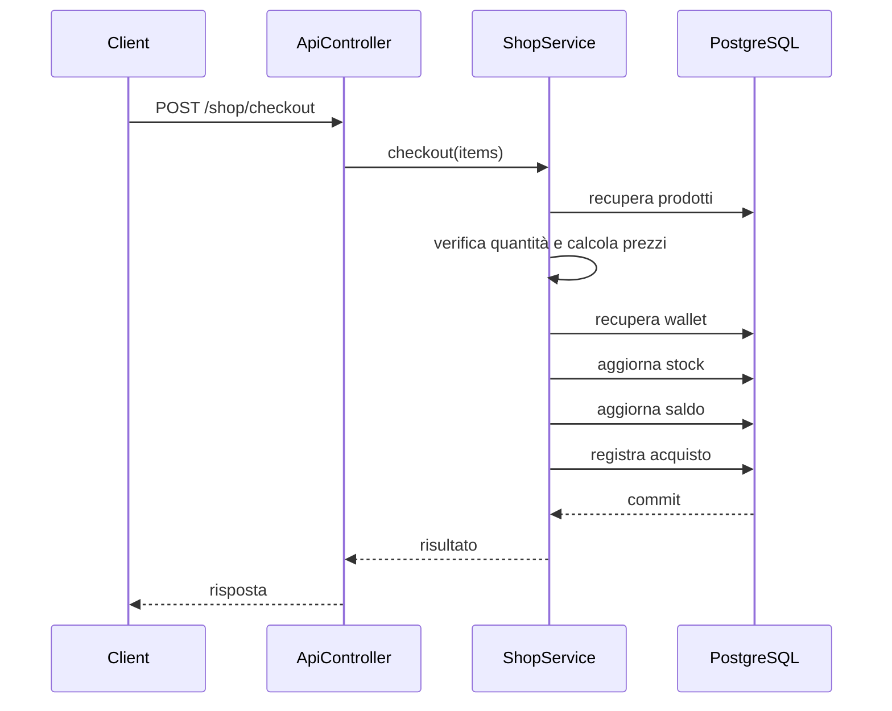

# ArteVia - Secure Art Marketplace

ArteVia è un'applicazione web per la gestione di un piccolo **marketplace dedicato all'arte e ai materiali artistici**, sviluppata con Spring Boot.

L'applicazione permette agli utenti di creare un account, gestire un wallet virtuale, sottoscrivere un abbonamento Insider, acquistare prodotti dal catalogo e visualizzare opere provenienti dalla collezione dell'**Art Institute of Chicago**.

La sicurezza costituisce una parte centrale del progetto: autenticazione stateless tramite JWT, refresh token persistiti e ruotati, autorizzazione basata sui ruoli, validazione degli input, protezione delle operazioni finanziarie e gestione delle richieste concorrenti sono implementate direttamente nei diversi livelli dell'applicazione.

L'applicazione è accessibile tramite **HTTPS** e mette a disposizione sia un'interfaccia web basata su Thymeleaf sia una REST API utilizzabile con client esterni.

---

## Indice

* [Panoramica](#panoramica)
* [Funzionalità](#funzionalità)
* [Tecnologie](#tecnologie)
* [Architettura](#architettura)
* [Modello dati](#modello-dati)
* [Screenshot dell'applicazione](#screenshot-dellapplicazione)
* [Security Design](#security-design)
* [Flussi principali](#flussi-principali)
* [Avvio del progetto](#avvio-del-progetto)
* [Utilizzo](#utilizzo)
* [Configurazione](#configurazione)
* [Gestione degli utenti amministratori](#gestione-degli-utenti-amministratori)
* [Struttura del progetto](#struttura-del-progetto)
* [REST API](#rest-api)
* [Verifica e test](#verifica-e-test)
* [Stato del progetto](#stato-del-progetto)

---

## Panoramica

ArteVia utilizza un'architettura monolitica organizzata secondo una separazione tra:

* livello web e REST;
* servizi applicativi;
* persistenza;
* componenti dedicati alla sicurezza;
* integrazione con servizi esterni.

Il browser utilizza le pagine Thymeleaf e le chiamate JavaScript verso la REST API. Gli stessi endpoint possono essere utilizzati indipendentemente tramite strumenti come Postman o `curl`.

Dal punto di vista funzionale, il dominio è organizzato intorno a tre elementi principali:

1. **utenti e autenticazione**;
2. **wallet e pagamenti interni**;
3. **catalogo e acquisti**.

Le operazioni che modificano contemporaneamente più risorse, come il checkout, vengono eseguite all'interno di transazioni database e utilizzano optimistic locking per gestire richieste concorrenti.

---

## Funzionalità

### Account e accesso

La registrazione crea un normale account `USER` e associa automaticamente un wallet.

L'accesso può essere effettuato utilizzando username oppure email. Dopo l'autenticazione vengono gestiti:

* access token JWT;
* refresh token persistito;
* cookie `HttpOnly`;
* cookie `Secure`;
* `SameSite=Lax`;
* rinnovo automatico dell'access token;
* invalidazione e rotazione dei refresh token.

Il ruolo dell'utente non viene inserito nel JWT: viene recuperato dal database quando viene costruito il contesto di sicurezza.

### Wallet

Ogni account dispone di un wallet virtuale utilizzabile per le operazioni del marketplace.

Sono disponibili:

* visualizzazione del saldo;
* ricarica;
* controllo del saldo prima degli acquisti;
* aggiornamento concorrente protetto tramite `@Version`.

Il wallet non rappresenta un sistema di pagamento reale: viene utilizzato esclusivamente come meccanismo interno al progetto.

### Catalogo

Il catalogo comprende diverse tipologie di prodotti, tra cui:

* stampe;
* dipinti;
* materiali per artisti;
* strumenti per il disegno e la pittura.

Ogni prodotto dispone di prezzo, descrizione, categoria e quantità disponibile.

Gli utenti possono consultare il catalogo e aggiungere gli articoli al carrello.

### Acquisti

Il checkout non utilizza i prezzi ricevuti dal browser come fonte attendibile.

Per ogni articolo il server:

1. recupera il prodotto dal database;
2. controlla la disponibilità;
3. recupera il prezzo corrente;
4. calcola il totale, applicando l'eventuale sconto Insider attivo;
5. verifica il saldo;
6. aggiorna stock e wallet;
7. registra l'acquisto.

L'intera operazione viene eseguita in una singola transazione.

### Insider Club

Gli utenti possono sottoscrivere un abbonamento Insider (piani con durata e sconto configurabili) che applica uno sconto percentuale automatico su ogni acquisto nel negozio. L'abbonamento attivo viene verificato lato server ad ogni checkout: il totale non è mai calcolato o modificato dal client, ma ricalcolato interamente dal backend leggendo lo stato reale dell'abbonamento dell'utente sul database, per evitare manomissioni dello sconto.

### Opera in evidenza

L'applicazione integra l'API pubblica dell'**Art Institute of Chicago**.

La funzionalità `/api/v1/artwork/featured` recupera un'opera dalla collezione (filtrata lato ARTIC per garantire la presenza di un'immagine) e restituisce al frontend le informazioni necessarie per visualizzarla.

L'accesso al servizio esterno viene effettuato attraverso `WebClient` (con timeout di connessione e risposta configurati) e protetto da un rate limiter per singolo utente. L'immagine dell'opera non viene caricata direttamente dal browser verso il CDN esterno, ma scaricata dal server e inoltrata al client tramite un endpoint proxy dedicato (`/api/v1/artwork/image/{imageId}`): evita così che il browser blocchi la richiesta cross-origin (Opaque Response Blocking) e che eventuali protezioni anti-hotlink del CDN esterno impediscano la visualizzazione.

### Funzionalità amministrative

Gli utenti con ruolo `ADMIN` possono aggiungere nuovi prodotti al catalogo tramite endpoint dedicati.

Il ruolo non può essere specificato durante la registrazione e gli endpoint amministrativi utilizzano `@PreAuthorize` per verificare l'autorizzazione.

---

## Tecnologie

| Area                 | Tecnologia                   | Versione               |
| -------------- | ------------------- | ---------------- |
| Linguaggio           | Java                         | 21 LTS                 |
| Framework            | Spring Boot                  | 4.1.0                  |
| Security             | Spring Security + JJWT       | JJWT 0.12.6            |
| ORM                  | Spring Data JPA + Hibernate  | gestito da Spring Boot |
| Database applicativo | PostgreSQL                   | 17+                    |
| Database di test     | H2                           | gestito da Spring Boot |
| Frontend server-side | Thymeleaf                    | gestito da Spring Boot |
| Mapping              | MapStruct                    | 1.6.3                  |
| Boilerplate          | Lombok                       | gestito da Spring Boot |
| Resilienza           | Resilience4j                 | 2.2.0                  |
| Test coverage        | JaCoCo                       | 0.8.14                 |
| Build                | Maven                        | 3.9.16                 |
| API esterna          | Art Institute of Chicago API | v1                     |
| Protocollo           | HTTPS / TLS                  | PKCS12                 |

---

## Architettura

L'elaborazione di una richiesta segue una catena simile a quella mostrata di seguito:



### Livelli principali

**Security layer**

Gestisce autenticazione, estrazione dei token, costruzione del `SecurityContext`, CORS e autorizzazione.

Componenti principali:

* `JwtFilter`;
* `JwtService`;
* `CookieUtils`;
* `UserDetailsServiceImpl`;
* `WebSecurityConfig`.

**Controller layer**

Espone le funzionalità dell'applicazione attraverso endpoint REST e pagine Thymeleaf.

Sono presenti controller separati per:

* autenticazione;
* funzionalità utente;
* amministrazione;
* rendering delle pagine.

**Service layer**

Contiene la logica applicativa. In particolare:

* `AuthService`;
* `RefreshTokenService`;
* `WalletService`;
* `ProductService`;
* `ShopService`;
* `MembershipService`;
* `ArtworkOfDayService`.

**Persistence layer**

La persistenza è realizzata attraverso Spring Data JPA e PostgreSQL.

Le entity non vengono utilizzate direttamente come contratto della REST API: le richieste e le risposte passano attraverso DTO dedicati.

---

## Modello dati

Le principali relazioni tra le entità sono:



### Entità principali

| Entità             | Responsabilità                                          |
| ------------- | --------------------------------------- |
| `User`             | Dati dell'account e ruolo                                 |
| `Wallet`           | Saldo virtuale dell'utente                                 |
| `RefreshToken`     | Sessione di refresh persistita                             |
| `Product`          | Articolo presente nel catalogo                             |
| `PurchasedProduct` | Registrazione di un acquisto                               |
| `ClubPlan`         | Piano di abbonamento Insider (nome, prezzo, sconto, durata) |
| `ClubMembership`   | Abbonamento attivo di un utente a un piano, con validità    |
| `Role`             | Ruoli `USER` e `ADMIN`                                     |

---

## Screenshot dell'applicazione

### Home


### Registrazione


### Validazione campi in fase di registrazione


### Login


### Shop


### Carrello


### Abbonamenti


### Storico Acquisti


### Opera del giorno


---

## Security Design

La sicurezza non è concentrata in un unico componente, ma viene applicata in diversi punti del flusso di una richiesta.

### Autenticazione

ArteVia utilizza due token con responsabilità differenti.

#### Access token

L'access token è un JWT:

* durata: 15 minuti;
* firma HMAC;
* `HttpOnly`;
* `Secure`;
* `SameSite=Lax`;
* subject contenente lo username.

Il JWT non contiene il ruolo dell'utente. Questo permette al sistema di non utilizzare un ruolo eventualmente diventato obsoleto nel token: il ruolo viene invece recuperato dal database quando viene costruito il contesto di autenticazione.

Per i client REST è inoltre possibile inviare il token attraverso:

```http
Authorization: Bearer <token>
```

Se la richiesta contiene sia l'header `Authorization` sia il cookie `accessToken`, ha la precedenza l'header.

#### Refresh token

Il refresh token è diverso dall'access token:

* non è un JWT;
* è una stringa casuale;
* viene memorizzato nel database;
* ha durata di 30 giorni;
* viene ruotato quando viene utilizzato;
* viene inviato al browser attraverso un cookie protetto.

Quando un refresh token viene utilizzato con successo, il valore precedente viene invalidato e sostituito.

#### Refresh automatico

Il `JwtFilter` controlla le richieste in ingresso. Quando l'access token non è più valido perché scaduto, il filtro può utilizzare il refresh token ancora valido per generare una nuova coppia di credenziali. Il meccanismo è trasparente al browser e non richiede un nuovo login.

### Controllo degli accessi

Le funzionalità applicative non sono tutte disponibili allo stesso livello.

```text
PUBLIC
 |-- registration
 |-- login / refresh / logout
 |-- pagine /, /auth/login, /auth/register e risorse statiche
 |-- /actuator/health

USER
 |-- wallet
 |-- catalog
 |-- artwork
 |-- membership
 |-- checkout

ADMIN
 |-- catalog administration
```

Una richiesta non autenticata verso `/api/**` riceve `401 Unauthorized` (JSON); una richiesta non autenticata verso una pagina viene reindirizzata a `/auth/login`. Un utente autenticato che non ha il ruolo richiesto riceve `403 Forbidden`.

Gli endpoint amministrativi utilizzano:

```java
@PreAuthorize("hasRole('ADMIN')")
```

Il ruolo non viene accettato come parametro durante la registrazione. Un nuovo account viene sempre creato come `USER`.

### Protezione delle operazioni di checkout

Il checkout rappresenta una delle operazioni più delicate perché modifica contemporaneamente più risorse.

La procedura viene eseguita in una transazione:

```java
@Transactional
```

Il server non considera attendibili né il prezzo né lo stock ricevuti dal client. Inoltre, `Product` e `Wallet` utilizzano optimistic locking attraverso `@Version`. In caso di aggiornamento concorrente, una delle operazioni può fallire con un conflitto invece di produrre uno stato incoerente.

**Proprietà che il checkout deve preservare:**

```text
prezzo reale dei prodotti (letto dal DB)
      =
totale verificato

totale verificato
      <=
saldo disponibile
```

Solo dopo il superamento delle verifiche vengono aggiornati: stock, saldo, storico degli acquisti.

### Validazione degli input

Le richieste HTTP vengono rappresentate tramite DTO specifici. Esempi: `RegisterRequest`, `LoginRequest`, `RechargeRequest`, `ProductCreateRequest`, `CheckoutRequest`, `BuyMembershipRequest`.

Le annotazioni Jakarta Validation vengono utilizzate per controllare, tra le altre cose: campi obbligatori, formato email, requisiti della password, quantità, importi, valori non negativi.

Le entity JPA non costituiscono quindi direttamente il contratto di input dell'API.

### Controlli di sicurezza implementati

| Scenario                                 | Meccanismo utilizzato                          |
| ---------------------------- | --------------------------------- |
| Furto dell'access token                  | breve durata + cookie `HttpOnly` e `Secure`    |
| Riutilizzo di un refresh token           | rotazione e invalidazione del token precedente |
| Modifica del ruolo tramite registrazione | DTO senza proprietà `role`                     |
| Accesso alle funzioni admin              | `@PreAuthorize` + ruolo verificato dal DB      |
| Alterazione del prezzo nel checkout      | prezzo recuperato dal database                 |
| Alterazione dello sconto Insider         | stato dell'abbonamento verificato dal database |
| Acquisto oltre lo stock disponibile      | controllo server-side + optimistic locking     |
| Doppio aggiornamento del wallet          | `@Version` + transazione                       |
| Stato parzialmente aggiornato            | `@Transactional`                               |
| Abuso dell'API esterna                   | rate limiting per utente                       |
| Input non valido                         | Jakarta Validation                             |
| Inserimento di HTML/JS nel frontend      | escaping tramite `escapeHtml()`                |
| Overflow della quantità nel carrello     | `@Max` sulla quantità + `Math.addExact`        |
| XSS memorizzato (stored XSS)             | escaping in output, verificato con prodotto malevolo |

---

## Flussi principali

### Autenticazione



### Acquisto



---

## Avvio del progetto

### Requisiti

* Java 21 o superiore;
* PostgreSQL 17 o superiore;
* Maven oppure il Maven Wrapper incluso nel repository;
* Docker, se si sceglie di utilizzare il database tramite container.

### 1. Clonazione

```bash
git clone https://github.com/giorgiapenn/ArteVia.git
cd ArteVia
```

### 2. Database

```bash
docker compose up -d
```

In alternativa, un'istanza PostgreSQL 17+ locale con un database `ARTEVIA` creato manualmente.

### 3. Certificato HTTPS

Il progetto include già un keystore PKCS12 con un certificato autofirmato in `src/main/resources/keystore.p12`: non è necessario generarlo per avviare l'applicazione.

#### Rigenerazione opzionale del keystore
Se si vuole creare un nuovo certificato autofirmato (es. dopo la scadenza dei 365 giorni), da `src/main/resources`:

```bash
keytool -genkeypair -alias https -keyalg RSA -keysize 2048 -storetype PKCS12 -keystore keystore.p12 -validity 365 -storepass changeit -dname "CN=localhost, OU=Dev, O=ArteVia, L=Roma, ST=Lazio, C=IT"
```


### 4. Compilazione

```bash
./mvnw clean package -DskipTests
```

Su Windows: `mvnw.cmd clean package -DskipTests`

### 5. Avvio

```bash
./mvnw spring-boot:run
```

L'applicazione sarà disponibile su `https://localhost:8443`. Con `spring.jpa.hibernate.ddl-auto=update`, Hibernate crea le tabelle mancanti all'avvio.

### 6. Dati iniziali

```sql
INSERT INTO product (name, description, price, stock_quantity, category, version) VALUES
  ('Stampa Van Gogh - Notte Stellata', 'Stampa fine-art su carta cotone 300g', 39.90, 25, 'Stampe', 0),
  ('Tela dipinta a mano - Paesaggio astratto', 'Opera originale acrilico su tela 50x70', 249.00, 3, 'Dipinti', 0),
  ('Set 24 matite colorate professionali', 'Matite Prismacolor per illustrazione', 34.50, 40, 'Materiali', 0),
  ('Tavolozza acquerelli 36 colori', 'Colori acquerello per artisti', 28.00, 30, 'Materiali', 0),
  ('Cavalletto da tavolo in legno', 'Cavalletto pieghevole per tele fino a 40cm', 22.90, 18, 'Materiali', 0),
  ('Stampa Klimt - Il Bacio', 'Riproduzione museale certificata', 44.90, 20, 'Stampe', 0),
  ('Blocco carta pressata a caldo A3', '20 fogli per acquerello e china', 16.50, 50, 'Materiali', 0),
  ('Scultura in ceramica - Busto astratto', 'Pezzo unico fatto a mano', 189.00, 2, 'Dipinti', 0);

INSERT INTO club_plan (name, price, duration_days, discount_percentage) VALUES
  ('Insider Monthly', 9.90, 30, 5),
  ('Insider Annual', 89.00, 365, 15);
```

---

## Utilizzo

### Interfaccia web

1. aprire `https://localhost:8443`;
2. creare un account;
3. effettuare il login;
4. accedere alla pagina personale;
5. ricaricare il wallet;
6. sottoscrivere eventualmente un piano Insider;
7. visualizzare l'opera in evidenza;
8. aprire il catalogo;
9. aggiungere prodotti al carrello;
10. completare il checkout.

```text
/
|-- /auth/register
|-- /auth/login
|-- /home/profile
|-- /home/shop
```

### Accesso REST

```text
/api/v1
```

```http
Authorization: Bearer <access-token>
```

In alternativa, i client che supportano i cookie possono utilizzare `accessToken` e `refreshToken`.

---

## Configurazione

`src/main/resources/application.properties`:

| Proprietà                                              | Funzione                                   | Valore                                     |
| ------------------------------------------------------ | ------------------------------------------ | ------------------------------------------ |
| `spring.datasource.url`                                | Connessione PostgreSQL                     | `jdbc:postgresql://localhost:5432/ARTEVIA` |
| `spring.datasource.username`                           | Utente database                            | `postgres`                                 |
| `spring.datasource.password`                           | Password database                          | `${DB_PASSWORD:postgres}`                  |
| `spring.jpa.hibernate.ddl-auto`                        | Gestione schema                            | `update`                                   |
| `jwt.secret`                                           | Chiave HMAC per la firma dei JWT           | `${JWT_SECRET:<chiave di sviluppo>}`       |
| `jwt.access-token.expiration-ms`                       | Durata access token                        | `900000` (15 minuti)                       |
| `jwt.refresh-token.expiration-ms`                      | Durata refresh token                       | `2592000000` (30 giorni)                   |
| `artic.api.base-url`                                   | Endpoint ARTIC                             | `https://api.artic.edu/api/v1`             |
| `resilience4j.ratelimiter.configs.articApi.*`          | Rate limit per utente                      | 5 richieste ogni 60 secondi                |
| `server.port`                                          | Porta HTTPS                                | `8443`                                     |
| `server.ssl.key-store`                                 | Keystore TLS                               | `classpath:keystore.p12`                   |
| `server.ssl.key-store-password`                        | Password keystore                          | `changeit`                                 |
| `server.ssl.key-alias`                                 | Alias certificato                          | `https`                                    |
| `management.endpoints.web.exposure.include`            | Endpoint Actuator esposti                  | `health,info`                              |

### Credenziali e segreti

I valori presenti nel progetto sono destinati esclusivamente all'esecuzione locale.

La password del database e la chiave di firma dei JWT vengono lette dalle variabili d'ambiente `DB_PASSWORD` e `JWT_SECRET`; se non sono definite, Spring utilizza i valori di default presenti in `application.properties`, adatti solo allo sviluppo.

Il file `.env.example` è un modello dei valori da impostare: Spring Boot non lo legge automaticamente, quindi le variabili vanno impostate nella shell prima dell'avvio. `DB_PASSWORD` deve coincidere con `POSTGRES_PASSWORD` di `docker-compose.yml`.

Linux / macOS:

```bash
export DB_PASSWORD=postgres
export JWT_SECRET='unaChiaveCasualeDiAlmeno32Caratteri'
./mvnw spring-boot:run
```

Windows (PowerShell):

```powershell
$env:DB_PASSWORD="postgres"
$env:JWT_SECRET="unaChiaveCasualeDiAlmeno32Caratteri"
.\mvnw.cmd spring-boot:run
```

Il keystore incluso nel repository è un certificato di sviluppo self-signed e non deve essere utilizzato come certificato di produzione.

### Database di test

`src/test/resources/application.properties` utilizza H2 in-memory: l'esecuzione della suite di test non modifica il database PostgreSQL utilizzato dall'applicazione.

### CORS

Il backend configura il Cross-Origin Resource Sharing (CORS) per consentire, in ambiente di sviluppo, richieste provenienti da eventuali frontend separati eseguiti sulle seguenti origini:

* `http://localhost:5500`
* `http://127.0.0.1:5500`

Configurazione definita in `WebSecurityConfig.corsConfigurationSource()`.

Il frontend Thymeleaf integrato nell'applicazione utilizza invece la stessa origine del backend (`https://localhost:8443`) e quindi non richiede CORS per le proprie richieste: la configurazione serve solo per un eventuale client separato (es. un frontend statico servito su una porta diversa durante lo sviluppo).

---

## Gestione degli utenti amministratori

La registrazione pubblica non permette di scegliere il ruolo dell'account. Il valore iniziale è sempre `USER`.

1. registrare normalmente l'utente;
2. accedere al database `ARTEVIA`;
3. modificare il ruolo:

```sql
UPDATE users
SET role = 'ADMIN'
WHERE username = 'nome_utente';
```

Poiché il ruolo viene recuperato dal database durante l'autenticazione della richiesta, la modifica viene applicata senza dover inserire il ruolo nel JWT. Un account `USER` che prova a chiamare un endpoint amministrativo riceve `403 Forbidden`.

---

## Struttura del progetto

```text
ArteVia/
|-- pom.xml
|-- lombok.config
|-- mvnw
|-- mvnw.cmd
|-- docker-compose.yml
|-- .env.example
|-- README.md
|-- screenshots/
|-- postman/
|   |-- ArteVia.postman_collection.json
|
|-- src/
|   |-- main/
|   |   |-- java/com/artevia/
|   |   |   |-- ArteViaApplication.java
|   |   |   |
|   |   |   |-- config/
|   |   |   |   |-- WebClientConfig.java
|   |   |   |
|   |   |   |-- controller/
|   |   |   |   |-- AdminController.java
|   |   |   |   |-- ApiController.java
|   |   |   |   |-- AuthController.java
|   |   |   |   |-- PageController.java
|   |   |   |
|   |   |   |-- dto/
|   |   |   |   |-- ArtworkDto.java
|   |   |   |   |-- BuyMembershipRequest.java
|   |   |   |   |-- CartItemRequest.java
|   |   |   |   |-- CheckoutRequest.java
|   |   |   |   |-- ClubPlanDto.java
|   |   |   |   |-- LoginRequest.java
|   |   |   |   |-- ProductCreateRequest.java
|   |   |   |   |-- ProductDto.java
|   |   |   |   |-- PurchasedProductDto.java
|   |   |   |   |-- RechargeRequest.java
|   |   |   |   |-- RegisterRequest.java
|   |   |   |   |-- TokenResponse.java
|   |   |   |   |-- WalletDto.java
|   |   |   |   |-- artic/
|   |   |   |       |-- ArticApiResponse.java
|   |   |   |
|   |   |   |-- exception/
|   |   |   |   |-- ExternalServiceUnavailableException.java
|   |   |   |   |-- GlobalExceptionHandler.java
|   |   |   |
|   |   |   |-- mapper/
|   |   |   |   |-- ClubPlanMapper.java
|   |   |   |   |-- ProductMapper.java
|   |   |   |   |-- PurchasedProductMapper.java
|   |   |   |   |-- WalletMapper.java
|   |   |   |
|   |   |   |-- model/
|   |   |   |   |-- ClubMembership.java
|   |   |   |   |-- ClubPlan.java
|   |   |   |   |-- Product.java
|   |   |   |   |-- PurchasedProduct.java
|   |   |   |   |-- RefreshToken.java
|   |   |   |   |-- Role.java
|   |   |   |   |-- User.java
|   |   |   |   |-- Wallet.java
|   |   |   |
|   |   |   |-- repository/
|   |   |   |   |-- ClubMembershipRepository.java
|   |   |   |   |-- ClubPlanRepository.java
|   |   |   |   |-- ProductRepository.java
|   |   |   |   |-- PurchasedProductRepository.java
|   |   |   |   |-- RefreshTokenRepository.java
|   |   |   |   |-- UserRepository.java
|   |   |   |   |-- WalletRepository.java
|   |   |   |
|   |   |   |-- security/
|   |   |   |   |-- CookieUtils.java
|   |   |   |   |-- JwtFilter.java
|   |   |   |   |-- JwtService.java
|   |   |   |   |-- UserDetailsImpl.java
|   |   |   |   |-- UserDetailsServiceImpl.java
|   |   |   |   |-- WebSecurityConfig.java
|   |   |   |
|   |   |   |-- service/
|   |   |       |-- ArtworkOfDayService.java
|   |   |       |-- AuthService.java
|   |   |       |-- MembershipService.java
|   |   |       |-- ProductService.java
|   |   |       |-- RefreshTokenService.java
|   |   |       |-- ShopService.java
|   |   |       |-- WalletService.java
|   |   |
|   |   |-- resources/
|   |       |-- templates/
|   |       |   |-- auth/
|   |       |   |   |-- login.html
|   |       |   |   |-- register.html
|   |       |   |-- home/
|   |       |   |   |-- profile.html
|   |       |   |   |-- shop.html
|   |       |   |-- index.html
|   |       |-- static/
|   |       |   |-- css/
|   |       |   |   |-- style.css
|   |       |   |-- images/
|   |       |-- application.properties
|   |       |-- application-dev.properties
|   |       |-- keystore.p12
|   |
|   |-- test/
|       |-- java/com/artevia/
|       |   |-- ArteViaApplicationIntegrationTests.java
|       |   |-- securitytest/
|       |   |   |-- AdminAccessControlIntegrationTest.java
|       |   |   |-- CheckoutTransactionIntegrationTest.java
|       |   |   |-- ConcurrentCheckoutIntegrationTest.java
|       |   |   |-- MassAssignmentIntegrationTest.java
|       |   |   |-- RateLimitingIntegrationTest.java
|       |   |   |-- RefreshTokenRotationIntegrationTest.java
|       |   |   |-- UserApiEndpointsIntegrationTest.java
|       |   |-- service/
|       |       |-- MembershipServiceTest.java
|       |       |-- ShopServiceTest.java
|       |       |-- WalletServiceTest.java
|       |
|       |-- resources/
|           |-- application.properties
```

---

## REST API

Base path `/api/v1`. Le operazioni che richiedono autenticazione accettano il JWT tramite cookie oppure `Authorization: Bearer <token>`.

### Account

#### `POST /api/v1/auth/register`
Crea un nuovo account. **Accesso:** pubblico
```json
{
  "username": "mario",
  "name": "Mario",
  "lastname": "Rossi",
  "email": "mario@test.com",
  "address": "Via Roma 1",
  "age": 25,
  "password": "Password1!"
}
```

#### `POST /api/v1/auth/login`
Effettua l'autenticazione. **Accesso:** pubblico
```json
{ "usernameOrEmail": "mario@test.com", "password": "Password1!" }
```
Risposta:
```json
{
  "accessToken": "<jwt>",
  "refreshToken": "<refresh-token>",
  "tokenType": "Bearer",
  "expiresIn": 900,
  "refreshExpiresIn": 2592000
}
```

#### `POST /api/v1/auth/refresh`
Genera una nuova coppia di token utilizzando un refresh token valido; il precedente viene invalidato. Il refresh token viene letto dal cookie `refreshToken` oppure, in sua assenza, dal body:
```json
{ "refreshToken": "<refresh-token>" }
```
**Accesso:** pubblico

#### `POST /api/v1/auth/logout`
Invalida il refresh token (letto dal cookie `refreshToken` oppure dal body `{ "refreshToken": "..." }`) e cancella i cookie di autenticazione. **Accesso:** pubblico: l'operazione ha effetto solo se viene fornito un refresh token valido.

L'access token già emesso non viene revocato: essendo un JWT stateless resta valido fino alla sua scadenza naturale (al massimo 15 minuti). Per questo motivo la sua durata è volutamente breve.

### Arte e contenuti

#### `GET /api/v1/artwork/featured`
Restituisce un'opera in evidenza proveniente dall'Art Institute of Chicago. **Accesso:** autenticato · **Rate limit:** 5 richieste/minuto per utente.
```json
{ "title": "...", "artist": "...", "date": "...", "imageUrl": "/api/v1/artwork/image/<image-id>" }
```
Se il limite viene superato: `429 Too Many Requests`

#### `GET /api/v1/artwork/image/{imageId}`
Scarica dal server l'immagine IIIF associata a un'opera e la inoltra al client come proxy, evitando che il browser effettui una richiesta diretta cross-origin verso il CDN di artic.edu. L'`imageId` viene validato con un'espressione regolare prima di costruire l'URL esterno. **Accesso:** autenticato · **Rate limit:** 5 richieste/minuto per utente, separato da quello di `/artwork/featured`.

Se il servizio esterno non è raggiungibile, entrambi gli endpoint rispondono `503 Service Unavailable`.

### Insider Club

#### `GET /api/v1/plans`
Restituisce l'elenco dei piani Insider disponibili. **Accesso:** autenticato

#### `POST /api/v1/membership/buy`
Sottoscrive un piano Insider per l'utente autenticato. **Accesso:** autenticato
```json
{ "planId": 1 }
```

### Wallet

#### `POST /api/v1/wallet/recharge`
```json
{ "amount": 50.00 }
```

#### `GET /api/v1/wallet/mywallet`
Restituisce il wallet associato all'utente autenticato.

### Catalogo

#### `GET /api/v1/products`
Restituisce i prodotti disponibili e il relativo stock. **Accesso:** autenticato

#### `POST /api/v1/admin/products`
Inserisce un nuovo prodotto. **Accesso:** `ADMIN`
```json
{ "name": "Pennelli professionali set 12pz", "description": "...", "price": 18.90, "stockQuantity": 15, "category": "Materiali" }
```
Un utente autenticato senza ruolo amministrativo riceve `403 Forbidden`.

### Acquisti

#### `GET /api/v1/user/shop/history`
Restituisce lo storico degli acquisti dell'utente, dal più recente.

#### `POST /api/v1/shop/checkout`
```json
{ "items": [{ "id": 1, "quantity": 2 }, { "id": 3, "quantity": 1 }] }
```
Risposta:
```json
{ "message": "Acquisto completato con successo!", "totalSpent": 12.48, "newBalance": 222.25 }
```
`400 Bad Request` per carrello/quantità non validi o stock/saldo insufficiente. `409 Conflict` per aggiornamento concorrente in conflitto.

#### `POST /api/v1/shop/cart/preview`
Calcola il totale del carrello con e senza sconto Insider applicato, senza effettuare l'acquisto. **Accesso:** autenticato
```json
{ "items": [{ "id": 1, "quantity": 2 }, { "id": 3, "quantity": 1 }] }
```
Risposta:
```json
{ "originalTotal": 15.60, "discountedTotal": 12.48, "discountPercentage": 20 }
```
---

## Verifica e test

```bash
./mvnw test
./mvnw clean verify
```

`mvn verify` applica la soglia minima di copertura JaCoCo: **80% instruction coverage**. Report HTML in `target/site/jacoco/index.html`.

I test utilizzano il database H2 in-memory configurato in `src/test/resources/application.properties`.

### Test di integrazione

| Test | Verifica |
| ---- | ------- |
| `MassAssignmentIntegrationTest` | Il campo `role` inviato durante la registrazione viene ignorato: l'account creato è sempre `USER`. |
| `AdminAccessControlIntegrationTest` | Un utente `USER` riceve `403` su `POST /api/v1/admin/products`; lo stesso utente promosso ad `ADMIN` nel database riceve `201`. |
| `RefreshTokenRotationIntegrationTest` | Un refresh token già utilizzato non può essere riutilizzato, sia tramite `/api/v1/auth/refresh` sia dopo il refresh silenzioso eseguito dal `JwtFilter`. |
| `RateLimitingIntegrationTest` | Dopo 5 richieste in un minuto a `/api/v1/artwork/featured`, la sesta riceve `429`. Il limiter conta la richiesta prima della chiamata esterna, quindi il comportamento è verificabile anche se l'API ARTIC non è raggiungibile. |
| `CheckoutTransactionIntegrationTest` | Un checkout rifiutato per saldo insufficiente non modifica lo stock. |
| `ConcurrentCheckoutIntegrationTest` | Due checkout concorrenti sull'ultimo pezzo disponibile: ne viene completato uno solo e lo stock finale è `0`. |
| `UserApiEndpointsIntegrationTest` | Flussi dell'utente autenticato: lettura e ricarica del wallet, elenco di prodotti e piani, acquisto di un piano Insider, registrazione dell'acquisto nello storico, invalidazione del refresh token al logout. |
| `ArteViaApplicationIntegrationTests` | Avvio corretto del contesto Spring. |

Le classi di integrazione sono basate su `@SpringBootTest` e `MockMvc`.

### Test unitari dei servizi (Mockito)

* `WalletServiceTest` - rifiuto di importi negativi o pari a zero, ricarica valida, errore in assenza di wallet;
* `ShopServiceTest` - prodotto inesistente, stock insufficiente, saldo insufficiente senza modifica dello stock, applicazione dello sconto Insider con aggiornamento di stock e saldo, nessuno sconto con abbonamento scaduto, rifiuto di quantità che causerebbero overflow;
* `MembershipServiceTest` - piano inesistente, saldo insufficiente senza creazione dell'abbonamento, disattivazione dell'abbonamento precedente e addebito del nuovo piano.

### Test di concorrenza

`ConcurrentCheckoutIntegrationTest` verifica uno scenario con stock disponibile = 1: due richieste eseguite su un pool di due thread e fatte partire nello stesso istante da un `CountDownLatch` di partenza; un secondo latch attende la fine di entrambe. Una sola richiesta viene completata; l'altra viene rifiutata, per conflitto di versione rilevato da `@Version` (`409`) oppure per stock insufficiente se legge lo stock già aggiornato (`400`). Lo stock finale è sempre `0` e non diventa mai negativo.

### Test manuali con Postman

La collection `postman/ArteVia.postman_collection.json` contiene 81 richieste con verifiche automatiche su: registrazione e mass assignment, attacchi al JWT (payload manomesso, `alg: none`, firma con chiave diversa), rotazione e riuso dei refresh token, refresh silenzioso, logout, validazione degli input, manomissione di prezzi e quantità, atomicità del checkout, sconto Insider, controllo degli accessi, rate limiting per utente, gestione degli errori e header di sicurezza.

1. In Postman: *Settings → General → SSL certificate verification* disattivato (certificato self-signed);
2. *Import* del file della collection;
3. con l'applicazione avviata e i dati iniziali caricati, eseguire le cartelle da `00` a `09` in ordine con il *Collection Runner*;
4. le richieste della cartella `10` vanno eseguite singolarmente, dopo aver lanciato la query SQL indicata nella descrizione di ciascuna.

Ogni esecuzione crea utenti con nomi univoci, quindi la collection può essere rieseguita senza svuotare il database.

### Verifica manuale dell'escaping

La protezione dei dati dinamici visualizzati dal frontend utilizza `escapeHtml()` (e `th:text` di Thymeleaf per lo username). Verifica creando, tramite account amministratore, un prodotto con nome `` (richiesta `10.4` della collection), poi aprendo `/home/shop`: il contenuto deve comparire come testo, non come codice HTML eseguito.

### SonarLint

Estensione IDE per l'analisi statica in tempo reale. Non richiede dipendenze Maven.

---

## Stato del progetto

ArteVia è pensato come progetto didattico per lo studio congiunto di: sviluppo web con Spring Boot, autenticazione e autorizzazione, sicurezza delle API REST, gestione transazionale, concorrenza a livello database, integrazione con API esterne, testing automatico delle proprietà di sicurezza.

Le credenziali, il certificato HTTPS e le configurazioni incluse nel repository sono esclusivamente destinate all'esecuzione locale e alla valutazione del progetto.